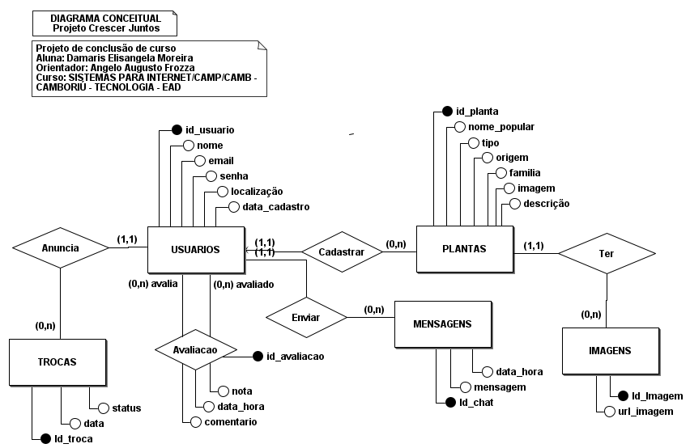
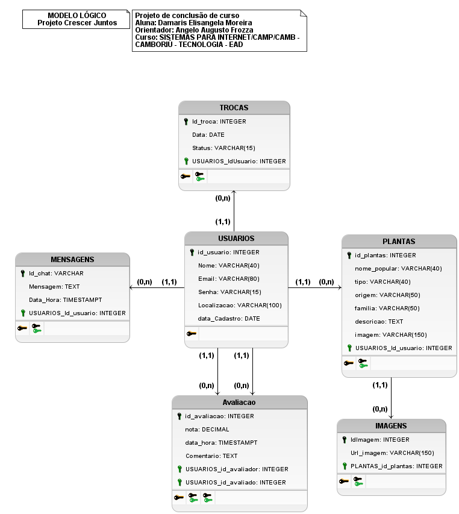

# Crescer Juntos – Backend Limpo (Django + PostgreSQL)

# 🌱 Crescer Juntos - API Backend


## 📖 Descrição
Este projeto é um backend desenvolvido com **Django** e banco de dados **PostgreSQL**, seguindo boas práticas de organização e escalabilidade.

API REST desenvolvida para gerenciar uma plataforma de troca de plantas e jardinagem colaborativa. O sistema conecta usuários que desejam trocar mudas, sementes e conhecimentos, promovendo a sustentabilidade.
---

## 🚀 Funcionalidades

- **👤 Gerenciamento de Usuários:** Cadastro, perfil e localização.
- **🌿 Catálogo de Plantas:** Cadastro detalhado com nome popular, científico, origem, família e fotos.
- **🔄 Sistema de Trocas:** Solicitação e gerenciamento de status (*Pendente, Aceito, Recusado*).
- **💬 Chat:** Envio de mensagens entre usuários interessados na troca.
- **⭐ Avaliações:** Sistema de notas e comentários para reputação dos usuários.
- **❤️ Health Check:** Monitoramento de status da API.
---

## 🛠️ **Tecnologias**
- 🐍 **Python** 3.12
- 🌐 **Django 5 + DRF**
- 🗄️ **PostgreSQL** 13+ (testado na 18)
- 🧪 **Testes**: Pytest & Postman
- 🐳 **Infraestrutura**: Docker, Docker Compose
- 🚀 **Deploy**: Render.com
---

## 📂 Estrutura do Projeto

✅crescer_juntos/# Configurações globais do Django (settings, urls)

✅docs/# Documentação e diagramas do Banco de Dados

✅main/# Aplicação principal (Models, Views, Serializers)

✅postman/# Coleções de teste da API (JSON) scripts/# Scripts auxiliares

✅staticfiles/# Arquivos estáticos gerados pelo Whitenoise

✅.env.example# Modelo das variáveis de ambiente

✅.gitignore# Arquivos ignorados pelo Git

✅docker-compose.yml# Orquestração dos containers (App + DB)

✅Dockerfile# Receita para criar a imagem Docker da API

✅manage.py# Gerenciador de comandos do Django

✅pytest.ini# Configuração dos testes automatizados

✅requirements.txt# Lista de dependências do projeto
```
📂 CRESCER_JUNTOS
├── .env.example
├── .gitignore
├── docker-compose.yml
├── Dockerfile
├── manage.py
├── pytest.ini
├── README.md
├── requirements.txt
├── crescer_juntos
│   ├── __init__.py
│   ├── asgi.py
│   ├── settings.py
│   ├── urls.py
│   ├── wsgi.py
│   └── __pycache__
├── main
│   ├── migrations
│   │   └── __init__.py
│   ├── admin.py
│   ├── apps.py
│   ├── models.py
│   ├── serializers.py
│   ├── tests.py
│   ├── urls.py
│   ├── views.py
│   └── templates
├── postman
│   └── crescer_juntos.postman_collection.json
├── scripts
└── docs
    ├── diagrama_conceitual.png
    ├── estrutura_banco.sql
    └── modelo_logico.png

```
## ⚙️ Pré-requisitos e Instalação

- ✅ Python 3.12+
- ✅ PostgreSQL 13+
- ✅ Git
- ✅ (Opcional) Docker + Docker Compose

---

## 🔧 **Instalação e Configuração**

### 1️⃣ **Clone o repositório**
```bash
git clone https://github.com/xdammyx/Projeto-crescer_juntos.git
cd crescer_juntos
```

2️⃣ Configurar Variáveis de Ambiente

Crie um arquivo .env na raiz do projeto usando o arquivo de exemplo como base:

cp .env.example .env

---

### 3️⃣ **Instale as dependências**
```bash
pip install -r requirements.txt
```
---

### 4️⃣ **Configure as variáveis de ambiente**
```bash
cp .env.example .env
```
Edite o `.env`:
```
POSTGRES_DB=crescer_juntos
POSTGRES_USER=seu_usuario
POSTGRES_PASSWORD=sua_senha
POSTGRES_HOST=localhost
POSTGRES_PORT=5432
```

---

## 🎨 **Diagramas do Banco de Dados**

### 🧠 **Diagrama Conceitual**


### 📐 **Modelo Lógico**



### 🗄️ **Estrutura do Banco (SQL)**
```sql
-- Estrutura do banco de Dados
-- Tabela USUARIOS
CREATE TABLE usuarios (
    id_usuario SERIAL PRIMARY KEY,
    nome VARCHAR(40) NOT NULL,
    email VARCHAR(80) UNIQUE NOT NULL,
    senha VARCHAR(15) NOT NULL,
    localizacao VARCHAR(100),
    data_cadastro DATE DEFAULT CURRENT_DATE
);

-- Tabela TROCAS
CREATE TABLE trocas (
    id_troca SERIAL PRIMARY KEY,
    data DATE NOT NULL,
    status VARCHAR(15),
    id_usuario INT NOT NULL,
    FOREIGN KEY (id_usuario) REFERENCES usuarios(id_usuario) ON DELETE CASCADE
);

-- Tabela PLANTAS
CREATE TABLE plantas (
    id_planta SERIAL PRIMARY KEY,
    nome_popular VARCHAR(40),
    tipo VARCHAR(40),
    origem VARCHAR(80),
    familia VARCHAR(50),
    descricao TEXT,
    imagem VARCHAR(150),
    id_usuario INT NOT NULL,
    FOREIGN KEY (id_usuario) REFERENCES usuarios(id_usuario) ON DELETE CASCADE
);

-- Tabela IMAGENS
CREATE TABLE imagens (
    id_imagem SERIAL PRIMARY KEY,
    url_imagem VARCHAR(150) NOT NULL,
    id_planta INT NOT NULL,
    FOREIGN KEY (id_planta) REFERENCES plantas(id_planta) ON DELETE CASCADE
);

-- Tabela MENSAGENS
CREATE TABLE mensagens (
    id_chat SERIAL PRIMARY KEY,
    mensagem TEXT NOT NULL,
    data_hora TIMESTAMP DEFAULT CURRENT_TIMESTAMP,
    id_usuario INT NOT NULL,
    FOREIGN KEY (id_usuario) REFERENCES usuarios(id_usuario) ON DELETE CASCADE
);

-- Tabela AVALIACAO
CREATE TABLE avaliacao (
    id_avaliacao SERIAL PRIMARY KEY,
    nota DECIMAL(3,1) CHECK (nota >= 0 AND nota <= 10),
    data_hora TIMESTAMP DEFAULT CURRENT_TIMESTAMP,
    comentario TEXT,
    id_avaliador INT NOT NULL,
    id_avaliado INT NOT NULL,
    FOREIGN KEY (id_avaliador) REFERENCES usuarios(id_usuario) ON DELETE CASCADE,
    FOREIGN KEY (id_avaliado) REFERENCES usuarios(id_usuario) ON DELETE CASCADE
);

```

## 🚀 Instalação e Configuração

### 1️⃣ Clone o repositório
```bash
git clone https://github.com/xdammyx/Projeto-crescer_juntos
cd crescer_juntos
```

### 2️⃣ Crie e ative o ambiente virtual

- **Windows (PowerShell):**
powershell
python -m venv .venv
.\.venv\Scripts\Activate

- **Windows (CMD):**
cmd
python -m venv .venv
.\.venv\Scripts\activate.bat

- **Linux/Mac:**
bash
python -m venv .venv
source .venv/bin/activate
```

### 3️⃣ Instale as dependências

pip install -r requirements.txt
## ▶️ Como Rodar o Projeto ## 
## ▶️ **Rodar o Projeto**
```bash
python manage.py migrate
python manage.py createsuperuser
python manage.py runserver
```
Acesse: **http://127.0.0.1:8000/api/**

---

## 🐳 **Deploy com Docker**

### ✅ **Windows (PowerShell ou CMD)**
1. **Subir containers**:
```powershell
docker-compose up --build
```

2. **Acessar container**:
```powershell
docker exec -it crescer_juntos_web bash
```

3. **Rodar migrações dentro do container**:
```bash
python manage.py migrate
```

> **Dica para Windows:** Se ocorrer erro de permissão, execute:
```powershell
Set-ExecutionPolicy RemoteSigned -Scope CurrentUser
```

---

### ✅ **Linux/Mac**
```bash
docker-compose up --build
docker exec -it crescer_juntos_web bash
python manage.py migrate
```

---


## 🔗 Endpoints principais
- Healthcheck: `GET /health/`
- API base (DRF): `GET /api/`
- CRUDs:
  - `usuarios`: `/api/usuarios/`
  - `trocas`: `/api/trocas/`
  - `plantas`: `/api/plantas/`
  - `imagens`: `/api/imagens/`
  - `mensagens`: `/api/mensagens/`
  - `avaliacoes`: `/api/avaliacoes/`

> Observação: O campo `senha` em `usuarios` não usa hashing (conforme seu esquema original). Em produção, recomendo usar autenticação do Django ou armazenar hash.

---

## 🧪 Testes com Postman
Este projeto inclui uma coleção do **Postman** para testar os endpoints da API.

### Como usar:
1. Abra o Postman.
2. Importe a coleção localizada em:
   ```
   /postman/crescer_juntos.postman_collection.json
   ```
3. Configure as variáveis de ambiente no Postman:
   - `base_url`: http://localhost:8000
   - `token`: (se necessário para autenticação)

### Endpoints na coleção:
- `GET /health/`
- `GET /api/`
- CRUDs: `/api/usuarios/`, `/api/trocas/`, `/api/plantas/`, `/api/imagens/`, `/api/mensagens/`, `/api/avaliacoes/`

---

## 🔐 Variáveis de ambiente principais
Veja `.env.example`.
- `DJANGO_SECRET_KEY` (obrigatório em produção)
- `DJANGO_DEBUG` ("1" ou "0")
- `ALLOWED_HOSTS` (separados por vírgula)
- `CORS_ALLOWED_ORIGINS` (separados por vírgula)
- `POSTGRES_DB`, `POSTGRES_USER`, `POSTGRES_PASSWORD`, `POSTGRES_HOST`, `POSTGRES_PORT`

---

---

## ✅ Testes automatizados
```bash
pytest
---


## 📄 Documentação
- Diagramas e modelos estão na pasta `docs/`:
  - `diagrama_conceitual.png` → diagrama conceitual
  - `modelo_logico.png` → Modelo lógico
  - `estrutura_banco.sql` → Script SQL do banco

- Coleção do Postman disponível em `postman/`.

---

## 📌 Observações
- Projeto segue arquitetura limpa.

✒️ Autor Damaris Elisangela Moreira
